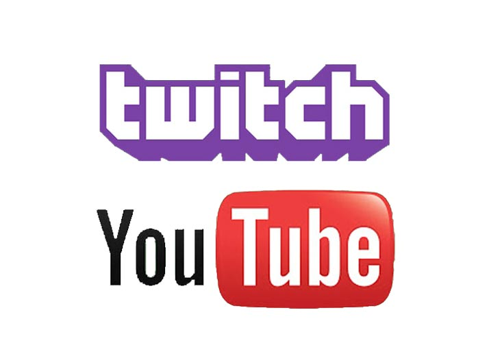

# Multiplatform Media Watch Tool
<p align="center"></p>

> Service which can work with several stream platforms and show streams at the same time
## Support
> Twitch
> Youtube

## Build Setup

``` bash
# install dependencies
npm install

# serve with hot reload at localhost:8080
npm run dev

# build for production with minification
npm run build

# build for production and view the bundle analyzer report
npm run build --report
```
